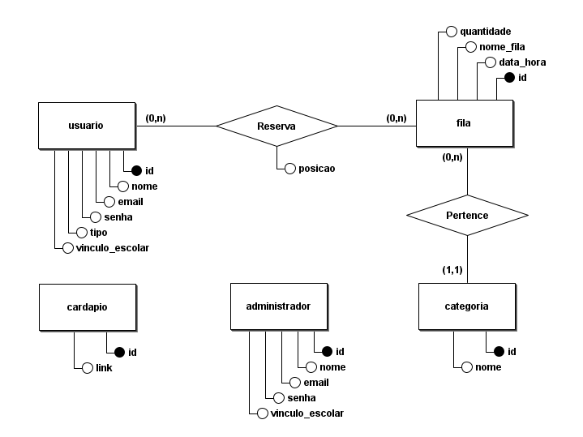
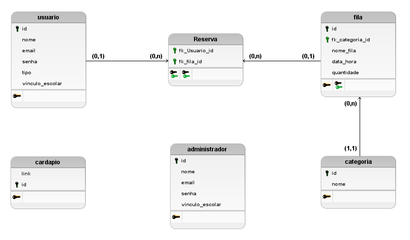

# Back End Bandejão
- `https://test3-kndm.onrender.com`

Este site está sendo desenvolvido para otimizar as filas do Refeitório do IFNMG Campus Salinas - MG. Este espaço irá organizar as filas de forma online, visando proporcionar uma melhor qualidade de vida aos estudantes e servidores, resultando em um melhor aproveitamento do tempo de intervalo.

## Banco de Dados da Aplicação

### Modelo Conceitual

### Modelo Lógico

### Modelo Físico
[**Arquivo SQL do modelo físico**](bd/DDL.sql)

---
#### Descrição
O banco de dados da plataforma Bandejão foi construído com o auxílio da ferramenta [brModelo](http://www.sis4.com/brModelo/), tendo sua escrita voltada ao banco de dados do tipo Postgree SQL e sendo hospedado na plataforma [Neon Tech](https://neon.tech).

---

## Lista de usuarios

- **Método:** GET
- **Permissões:** Permite a qualquer usuário acessar.
- **Descrição:** Retorna uma lista de todos os usuários no banco de dados.
- **Endpoint:** `https://test3-kndm.onrender.com/usuarios`

## Criação de usuario

- **Método:** POST
- **Permissões:** Permite a qualquer usuário acessar.
- **Descrição:** Adiciona um novo usuário ao banco de dados com base nos dados fornecidos.
- **Endpoint:** `https://test3-kndm.onrender.com/usuario/`
- **Body:** {
   "Vinculo_Escolar": "vinculo",
   "Tipo_Usuario" : "Seu tipo: Servidor, Aluno do tecnico, Aluno do medio, Visitante"
   "ID": "id",
   "Email": "email",
   "Senha": "senha",
   "Nome": "nome"
}

## Alterações de dados do usuário, consulta de usuário por id e exclusão de usuário

- **Métodos:** GET, PUT, DELETE
- **Permissões:** Permite a qualquer usuário acessar.
- **Descrição:**
- **GET:** Retorna detalhes de um usuário específico com base no ID fornecido.
- **PUT:** Atualiza os dados de um usuário específico com base no ID fornecido.
- **DELETE:** Exclui um usuário específico com base no ID fornecido.
- **Endpoint:** `https://test3-kndm.onrender.com/usuario/<int:user_id>/`
- **Body apenas para as requisições do tipo PUT:**{
   "Vinculo_Escolar": "vinculo",
    "Tipo_Usuario" : "Seu tipo: Servidor, Aluno do tecnico, Aluno do medio, Visitante",
   "Email": "email",
   "Senha": "senha",
   "Nome": "nome"
}

## Lista de usuarios adiminisrativos

- **Método:** GET
- **Permissões:** Permite a qualquer usuário acessar.
- **Descrição:** Retorna uma lista de todos os usuarios adiminisrativos no banco de dados.
- **Endpoint:** `https://test3-kndm.onrender.com/admins`

## Criação de usuario adiminisrativo

- **Método:** POST
- **Permissões:** Permite a qualquer usuário acessar.
- **Descrição:** Adiciona um novo usuario adiminisrativo ao banco de dados com base nos dados fornecidos.
- **Endpoint:** `https://test3-kndm.onrender.com/admin/`
- **Body:** {
   "Vinculo_Escolar": "vinculo",
   "ID": "id",
   "Email": "email",
   "Senha": "senha",
   "Nome": "nome"
}

## Alterações de dados do usuario adiminisrativo, consulta de usuario adiminisrativo por id e exclusão de usuario adiminisrativo

- **Métodos:** GET, PUT, DELETE
- **Permissões:** Permite a qualquer usuário acessar.
- **Descrição:**
- **GET:** Retorna detalhes de um usuario adiminisrativo específico com base no ID fornecido.
- **PUT:** Atualiza os dados de um usuario adiminisrativo específico com base no ID fornecido.
- **DELETE:** Exclui um usuario adiminisrativo específico com base no ID fornecido.
- **Endpoint:** `https://test3-kndm.onrender.com/admin/<int:admin_id>/`
- **Body apenas para as requisições do tipo PUT:**{
   "Vinculo_Escolar": "vinculo",
   "Email": "email",
   "Senha": "senha",
   "Nome": "nome"
}
## Queue Management

### Joining the Queue

- **Method:** POST
- **Permissions:** Allows any user to access.
- **Description:** Adds a student to the queue.
- **Endpoint:** `https://test3-kndm.onrender.com/fila/join`
- **Body:** {
   "student_id": "<student_id>"
}

### Verificando a Posição na Fila

- **Método:** GET
- **Permissões:** Permite a qualquer usuário acessar.
- **Descrição:** Retorna a posição de um aluno na fila.
- **Endpoint:** `https://test3-kndm.onrender.com/fila/position`
- **Parâmetros de Consulta:** `student_id=<student_id>`

### Saindo da Fila

- **Método:** DELETE
- **Permissões:** Permite a qualquer usuário acessar.
- **Descrição:** Remove um aluno da fila.
- **Endpoint:** `https://test3-kndm.onrender.com/fila/leave`
- **Corpo:** {
   "student_id": "<student_id>"
}

### Criando uma Fila

- **Método:** POST
- **Permissões:** Permite a qualquer usuário acessar.
- **Descrição:** Cria uma nova fila.
- **Endpoint:** `https://test3-kndm.onrender.com/fila/`
- **Corpo:** 
{
   "nome": "<nome>",
   "data_hora": "<data_hora>",
   "tamanho": "<tamanho>"
}

### Obtendo Todas as Filas

- **Método:** GET
- **Permissões:** Permite a qualquer usuário acessar.
- **Descrição:** Retorna todas as filas.
- **Endpoint:** `https://test3-kndm.onrender.com/fila/`

### Obtendo uma Fila Específica

- **Método:** GET
- **Permissões:** Permite a qualquer usuário acessar.
- **Descrição:** Retorna uma fila específica.
- **Endpoint:** `https://test3-kndm.onrender.com/fila/<int:queue_id>/`

### Atualizando uma Fila

- **Método:** PUT
- **Permissões:** Permite a qualquer usuário acessar.
- **Descrição:** Atualiza uma fila específica.
- **Endpoint:** `https://test3-kndm.onrender.com/fila/<int:queue_id>/`
- **Corpo:** 
{
   "nome": "<novo_nome>",
   "data_hora": "<nova_data_hora>",
   "tamanho": "<novo_tamanho>"
}
### Excluindo uma Fila

- **Método:** DELETE
- **Permissões:** Permite a qualquer usuário acessar.
- **Descrição:** Exclui uma fila específica.
- **Endpoint:** `https://test3-kndm.onrender.com/fila/<int:queue_id>/`

## Gerenciamento de Menu

### Criando um Item de Menu

- **Método:** POST
- **Permissões:** Permite a qualquer usuário acessar.
- **Descrição:** Cria um novo item de menu.
- **Endpoint:** `https://test3-kndm.onrender.com/cardapio/`
- **Corpo:** 
{
   "link": "<link>"
}
### Obtendo Todos os Itens de Menu

- **Método:** GET
- **Permissões:** Permite a qualquer usuário acessar.
- **Descrição:** Retorna todos os itens de menu.
- **Endpoint:** `https://test3-kndm.onrender.com/cardapio/`

### Obtendo um Item de Menu Específico

- **Método:** GET
- **Permissões:** Permite a qualquer usuário acessar.
- **Descrição:** Retorna um item de menu específico.
- **Endpoint:** `https://test3-kndm.onrender.com/cardapio/<int:menu_item_id>/`

### Atualizando um Item de Menu

- **Método:** PUT
- **Permissões:** Permite a qualquer usuário acessar.
- **Descrição:** Atualiza um item de menu específico.
- **Endpoint:** `https://test3-kndm.onrender.com/cardapio/<int:menu_item_id>/`
- **Corpo:** 
{
   "link": "<novo_link>"
}
### Excluindo um Item de Menu

- **Método:** DELETE
- **Permissões:** Permite a qualquer usuário acessar.
- **Descrição:** Exclui um item de menu específico.
- **Endpoint:** `https://test3-kndm.onrender.com/cardapio/<int:menu_item_id>/`
